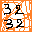

# Github // Alexandre Venet

## Texte H2 avec *italique* et `*cde*`

Coucou ! 🤗

Paragraphe avec des chevrons < toto >.

Du **texte** *bizarre* ***avec*** *mise* *en* ***forme*** **bizarre**.

**Du strong, puis de l'*em*. Fin**. Puis, un `code de plusieurs choses`.

Un lien gras : **[lien](#)**

Un lien autre [lien `toto`](# "bulle d'*aide*").

Différents liens : [tata](# _blank), [tata](# "toto" _blank).

Texte avec une image dedans . Youpi ! 

Un lien avec une image dedans [](# "bulle").

Texte HTML : <button type="button">cliquer</button>.

Insérer un nom d'oeuvre, par exemple --Iliade-- d'Homère, grâce à des indicateurs personnels. Ci-après une citation avec source falcultative, le tout dans une balise `figure`.

> Coucou ! 🤗
> [...]
> Texte avec chevrons <button type="button">cliquer</button>.

!> Alexandre Venet, --[ConvertisseurJsMdHtml](https://alexandrevenet.github.io/ConvertisseurJsMdHtml)--

Une autre citation, de moi, aussi dans `figure` mais cette fois sans `figcaption` :

> toto

## Autre sous-titre

Du code multi-ligne :
```
code
		ligne indentée de 2 tabulations
	
	saut de ligne
	
	Les chevrons sont transformés en HTML entities : <button>
```

```C#
private void MaFonction(string entree)
{
	// Fonction C#
}
```

L'image suivante doit être dans une balise `<figure>`.


!- Ce paragraphe est la légende de l'image précédente. Ceci autorise la **mise en forme**, [Lien d'exemple](https://alexandrevenet.github.io).

Test avec du `code avec étoile *`.

Test avec du `code avec *plusieurs étoiles* **a** ***b*a** [qsd](qsd) <button>`. 

Du texte ***strong-em avec du `code *em*` dedans***. Du `code avec du ***strong-em*** dedans`. Un lien en italique avec des étoiles [un <*lien*>](#).

listes imbriquées

1. toto
	- a
	- b
2. tata
3. titi
	1. un
	2. deux
	3. trois en **gras**

Autre liste

- a
- b
	1. 1
	2. 2
- c

Test

- a
- b
	- aa
		- aaa
	- bb
- c

Tableau

|a|deux|troisième
|-|-|-|
|😁|le chiffre deux est *magnifique*|oups ! héhé |
|toto|tata|titi|

1|2|3
-|-|-
**a**|*b*|***c***
x|y|z


